# Team Project (AirBnb Clone)

## Introduction

The project aims to build a Google Cloud Hosted Enterprise Application for an AirBnb Clone.

The project is a team project that is comprised of 5 members. The project is a clone of AirBnb (without the booking / date feature).

We have used the following technologies:

- Google Cloud Platform
- MySQL
- Java / Spring
- React.Js
- Docker
- Kubernetes
- Kong API Gateway
- Kubernetes Ingress
- JWT for Authentication

## Team Members

- Daniel Saneel - [Journal](Journals/Daniel/DanielProgress.md)
- Jay Brahmbhatt - [Journal](Journals/Jay/JayProgress.md)
- Prem Dhar [Journal](Journals/PremProgress.md)
- Quang Nguyen - [Journal](Journals/Quang/QuangProgress.md)
- Varun Reddy Mallepally

## Architechture Diagram

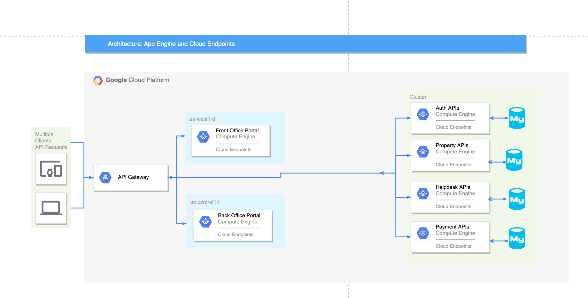

## Project Notes

### 1. Functional Requirements

#### Front Office Portal:

- A "Front Office" Web Application that allows customers to:

  - sign-up for accounts,
  - log-in to their account,
  - browse product catalog,
  - place, and pay for orders using credit cards.

#### Back Office Portals:

- A "Back Office" Web Applications that supports customers Queries

- The Back office also has its own backend Spring Boot Application that supports the following functionalities:

  - Viewing & Resolving Customer Queries

### 2. Technical Requirements

The application was implemented in Java Spring and be deployable as Docker Containers on Google Cloud VM's and/or Kubernetes Engine (GKE).

The source code is hosted in an assigned Team Repository in CMPE172 GitHub Organization.
All team members were committing work to GitHub.

#### Software Stack & Tools

- **Must use Spring Framework (Spring MVC, Spring JPA):**

  - The app uses Spring Framework for **all backend application / services.**
  - For Back Office Portal(s)
  - For REST APIs

  <br/>

- For customer facing Front Office Portal, team can chose front end Tech Stack

  - We utilized **React.js** for Front Office Portal, and used Bootstrap & Material UI for styling components.

  <br/>

- **Development Tools**

  - Builds must be done with Gradle
  - Version of Java should be JDK 11
    <br/>

- **Database & Middleware Requirements**

  - **MySQL Database:** (We used MySQL database for persisting all the data)
    <br/>
  - **RabbitMQ**
    <br/>
  - **Kong API Gateway:** the kong gateway is deployed on the GKE ingress, and all the services are exposed through the kong gateway.
    <br/>
  - **Credit Card Payments:** Support
    Integration with CyberSource Payment Gateway

### 3. Project Screenshots / Demo

#### Front Office Portal

1. Home Page

   

   <br/>

2. Sign Up

   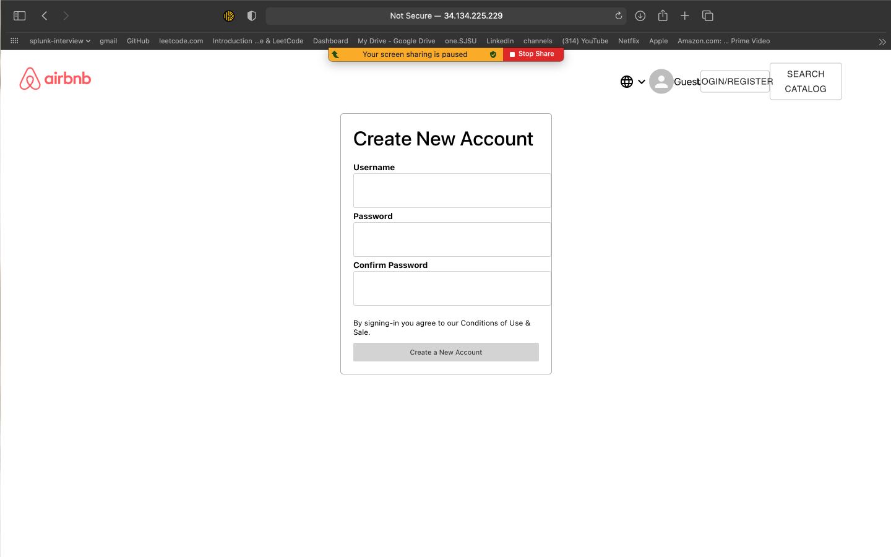

    <br/>

3. Sign In Page

   

  <br/>

4. Home Page

   

   <br/>

5. Product Catalog page

   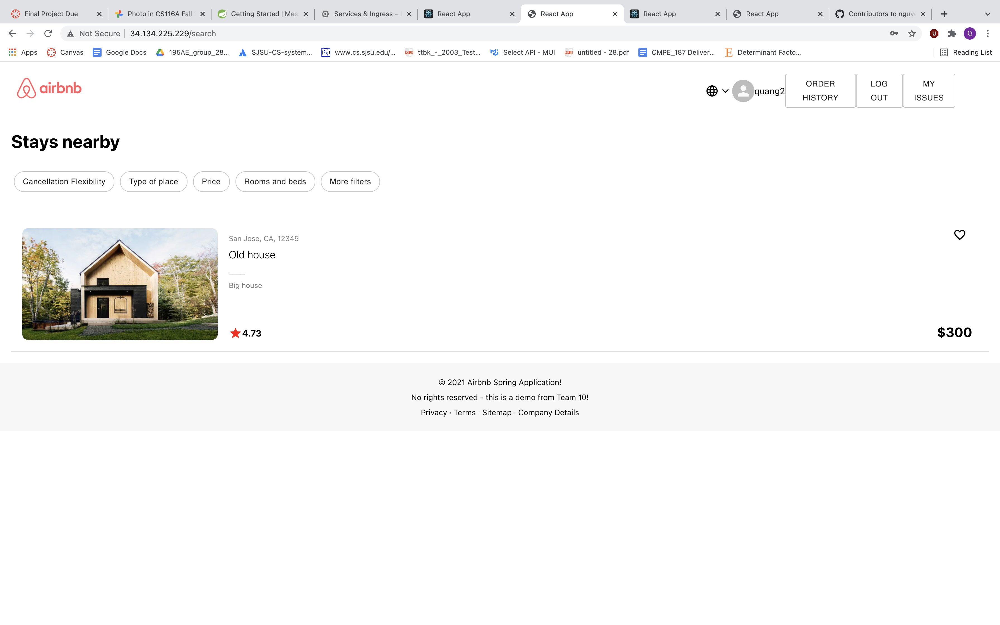

   <br/>

6. Property Details / Order Page

   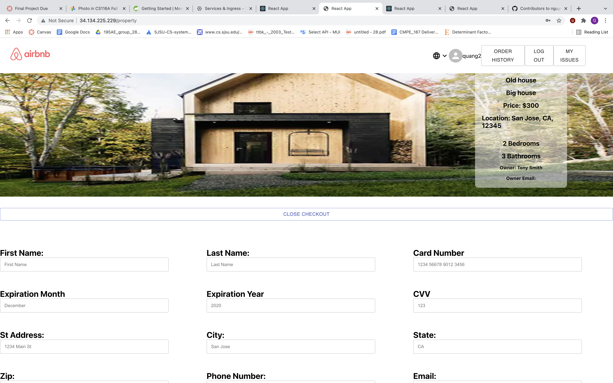

   <br/>

7. Order History Page

   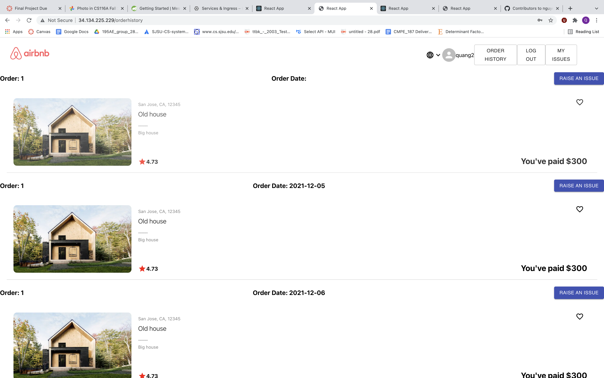

   <br/>

8. Raise a Query Page

   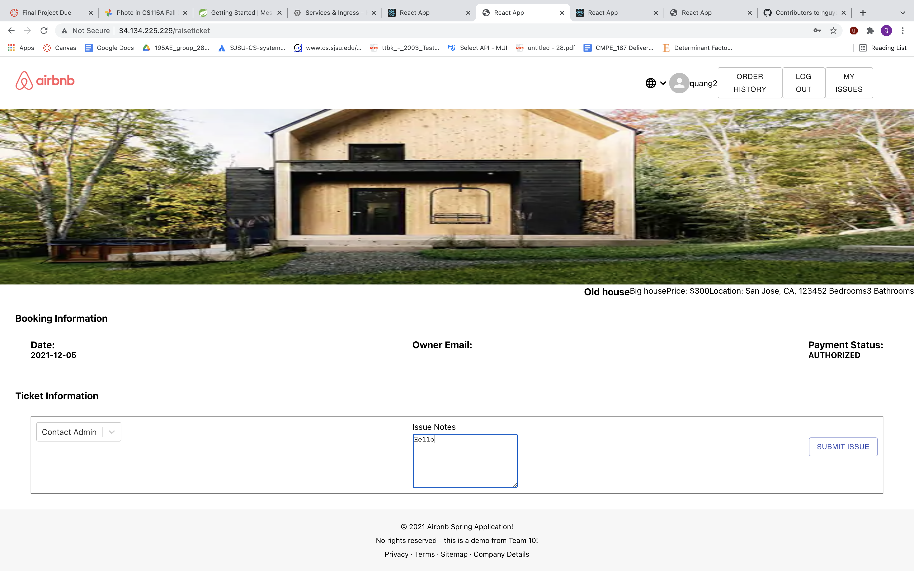

   <br/>

9. View Raised Queries

   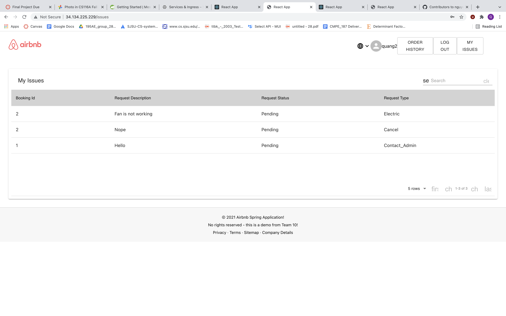

   <br/>

#### Back Office Portal

1. Auth Page

   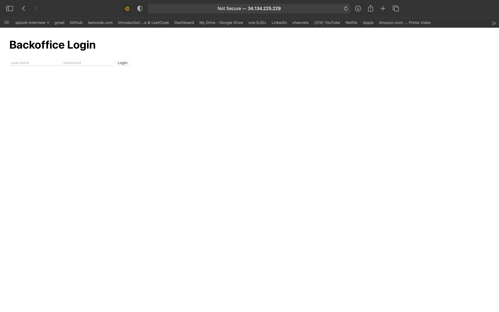

    <br/>

2. Customer Queries

   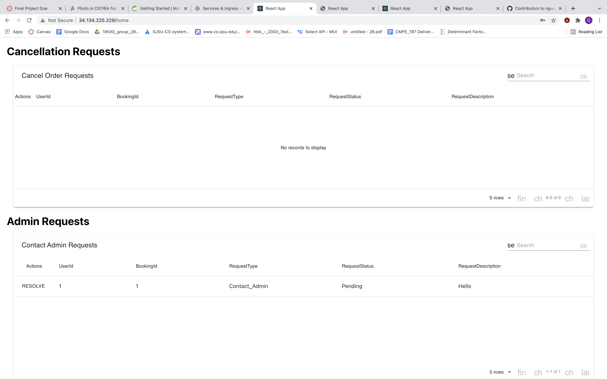

   <br/>

#### GCP Images

1. Workloads

   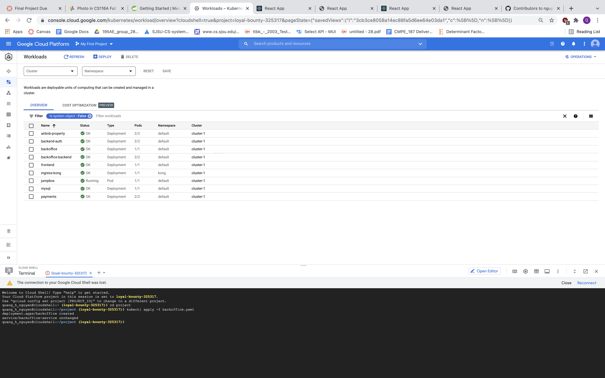

   <br/>

2. GKE Services

   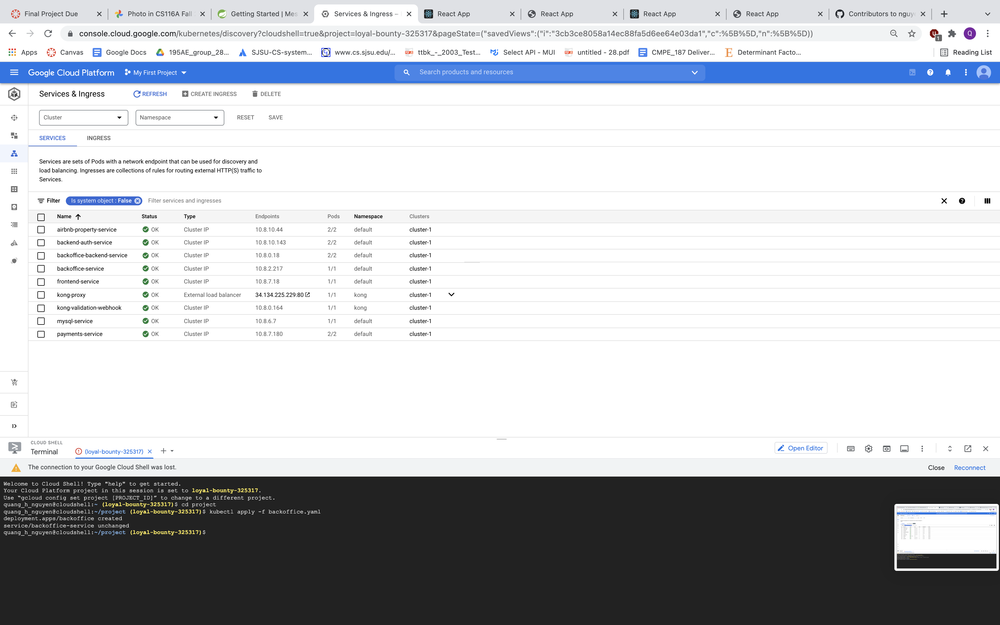

   <br/>

3. GKE Ingress Details

   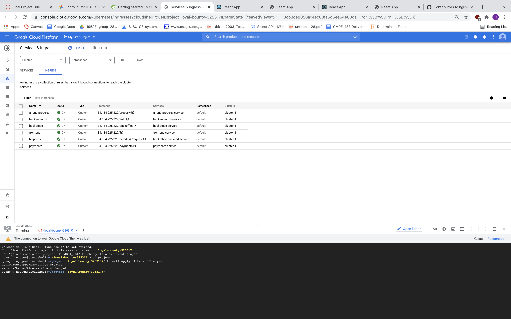

   <br/>

4. GKE MySQL

   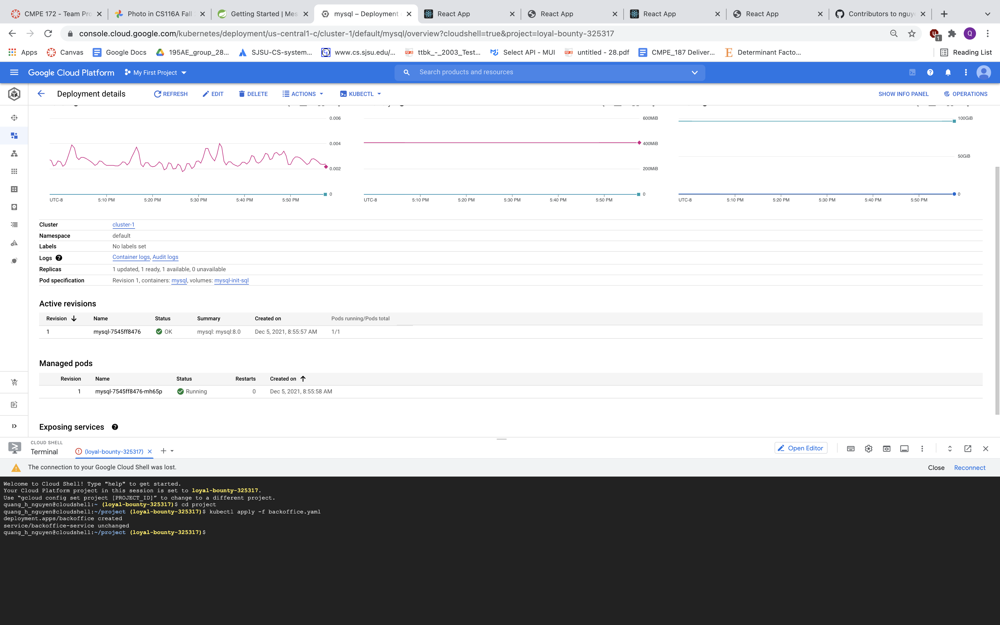

   <br/>

### 4. Video Demo

[Demo Link](https://sjsu.zoom.us/rec/share/031lGqLKlejNW9mBYWNKV3QjLjHYQxJBCKB2LlM7GxliLRirXXiCc5VJDlZfaddw.GXGLLL1eHrChLxBq?startTime=1638852393000)

```
Demo Password:
uB85+qT\*
```

<br/>

## Additional Project Links
